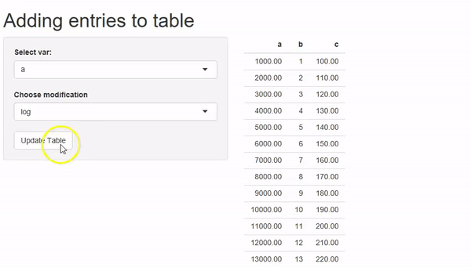

# RShiny Snippets
Shiny snippets for improving apps and solving common problems

This document contains a collection of various Shiny snippets that people often face problems in. Each folder contains a complete functional Shiny app that demonstrates how to perform a non trivial task in Shiny.

### Table of contents ###

•	[Adding up Message Boxes and Removing](https://github.com/surajsharan/RShiny/blob/master/adding%20up%20error%20messages%20notifications.R) 

•	[Adding Entries to the table in run-time](https://github.com/surajsharan/RShiny/blob/master/adding_colnames_inruntime.R)

•	[Alert in the Input boxes for improved user experience](https://github.com/surajsharan/RShiny/blob/master/alerts.R)

